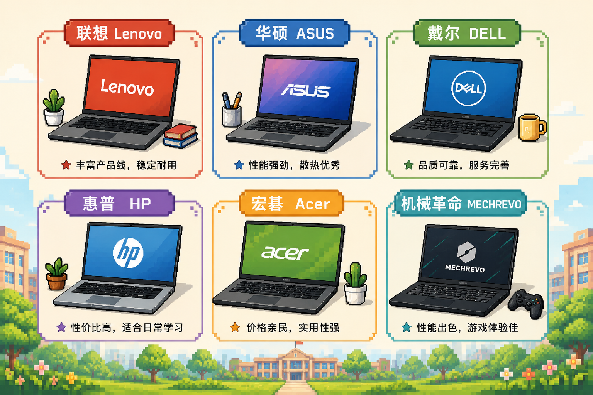
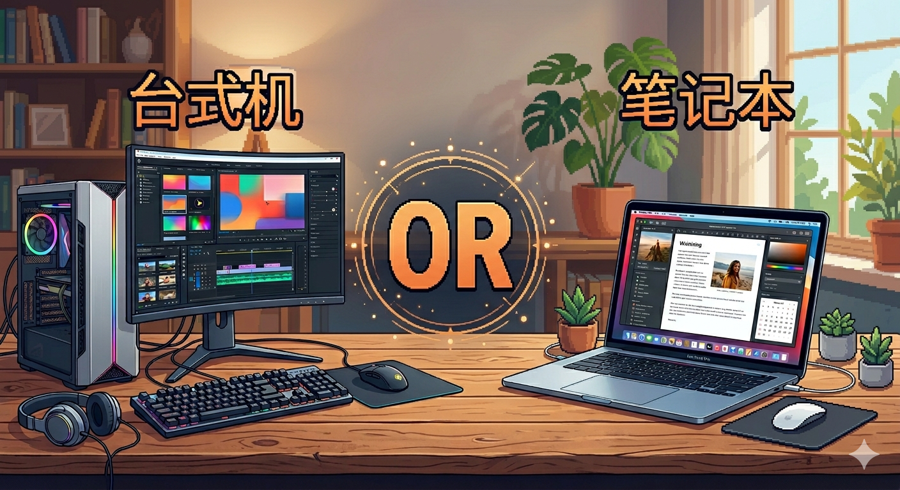
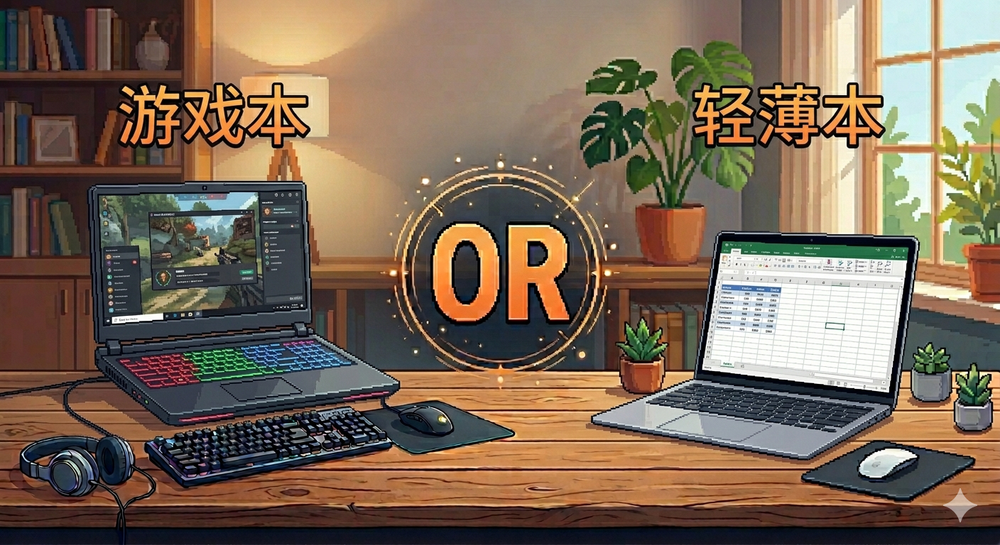

# 购买
使用电脑之前肯定首先得买一台电脑，怎么买其实小破站上很多各种各样的品牌型号的测评，非常详细基本上什么参数都有，不做任何推荐，按需购买即可。  
另外讲几个注意的事：  
首先，电脑的品牌选择上，各个品牌其实目前为止基本都暴雷过了无所谓了随便买吧，大品牌售后可能相对方便一点门店多，但会有相对的溢价，小品牌就相对少一些，大概率是最后自己学会解决各种问题。不太建议那几个手机品牌做的电脑。

第二点是购买渠道，只推荐线上的各大电商平台的旗舰店和官网，不推荐线下，尤其是所谓的熟人介绍，机圈经典名言，生人骗一半，熟人大满贯，不排除有好心的，但是很少不建议赌，尤其是上大学那台电脑大概率要用很久，而且电脑这笔钱也不是小数目。   
第三点是台式机or笔记本，正常情况下肯定笔记本，就目前这个行情本来装机就够呛，还有就是大部分学校宿舍用电是有功率限制的，而且宿舍空间一般比较有限，而且即使带出去的机会再少也是会有带出去的时候的，课程设计，毕业设计可能是要带着找老师的，还有就是有的人可能想参加一些比赛可能是要带着去现场的，放假的时候带回家玩也方便点。   

第四点是轻薄本和游戏本，有很多人对这个名字存在误解我解释一下，游戏本就是重得跟两三块板砖一样得，有独立显卡，性能释放更彻底更好得高性能笔记本电脑，轻薄本就是相对来说机身和充电器都相对轻一些，只有核显，性能释放和散热都相对差些得笔记本电脑，自行按需选择。   

# 验机
其实一般来说，在我前面说的比较官方得渠道购买的话一般不会有什么大问题，但是还是可以稍微验一下机并且录下来省的万一要扯皮麻烦。   
建议拆箱之前就打开录像并全程记录不给扯皮空间，具体非常详细的验机教程小破站上也有，我就大概讲个粗略验机过程。   
首先拆箱之前检查下箱体看看有没有暴力运输的破损，一般来说里面都塞有很厚的填充物很难影响到内部，但是如果有破损还是记录下来以防万一，拿到本体后可以看看一些亮面有没有指纹之类的，防止买到退货的摸摸机，然后插电开机进系统，**不要联网！联网那个步骤可以跳过的，另外设置用户名的时候请用纯英文数字**。然后用U盘之类的设备从别的地方下个鲁大师，图吧工具箱之类的能看具体硬件配置的，对照自己买的商品详情页看下有没有配置上的货不对板。最后感兴趣的可以跑个娱乐大师的抽烟环节看看跑分发个朋友圈啥的。但这里一般就该干啥干啥了没啥大问题，想要更详细的可以自己上小破站看看相关的视频，我是到这就不管了。 

