## 系统设置
在上一篇文章已经完成了电脑的购买，验机成功通电进入系统。这篇讲点常用的设置和软件。由于我这老旧电脑是以前上大学买的系统是win10的，但其实是大差不差的设置大的名字基本没区别就是可能换了个地方而已。  
首先，进入桌面后可以鼠标右键桌面，左键点击个性化，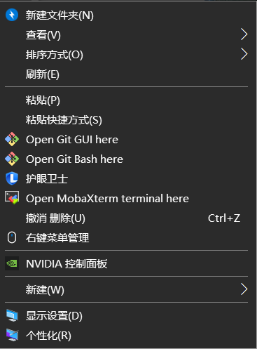  
再点击主题，向下滑找到桌面图标设置，点击进入  
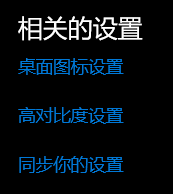  
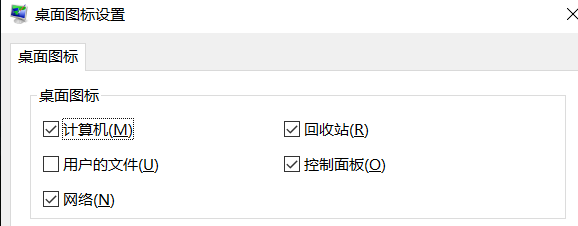  
在界面上就可以看到计算机（也就是此电脑，回收站这些系统自带的一些图标，如果误删了或者开机发现没有可以到这里找到勾上然后点击应用，确定就可以恢复出来了，然后，一般建议把控制面板勾上，会比较常用。也可以直接在桌面左下角的开始里进入设置里找到这个设置。  
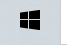  
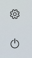  
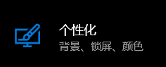  
顺带一提齿轮是设置下面是电源键关机和重启都在里面。新购买的笔记本电脑一般会送有正版的win系统和office，开机联网激活后需要在一定时间内登录绑定账号不然会过期。因此，需要到刚才的设置里进入账户设置去注册并登录自己的微软账户。  
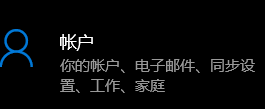  
## 软件推荐
系统内的设置到这其实就没啥，具体一些其他设置需要的时候可以自行再去调整，然后还有一个非常重要的问题就是，使用电脑过程中尽量能用英文的都用英文，实在不行拼音也行，比如新建文件夹，安装软件的路径什么的，因为很多东西对中文的支持比大家想象的要差，避免给自己找不必要的麻烦。  
接下来是软件问题，首先是最常用的**浏览器**，系统一般自带有一个叫**edge的浏览器**，我个人觉得就已经挺好用了，并且也支持插件啥的，另一个就是谷歌家的**chrom浏览器**我个人也比较喜欢用功能相对齐全好用，没有那么多广告什么的，也是比较推荐，其他的就不推荐了。  
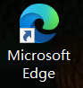  
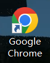  
其次就是**卸载软件**的工具，一般来说卸载软件是可以简单粗暴的找到我们之前调出来的控制面板，进入程序里进行卸载，当然有的人打开控制面板发现界面跟我图上的不一样，可以点击右上角的查看方式选择类别就一样了。  
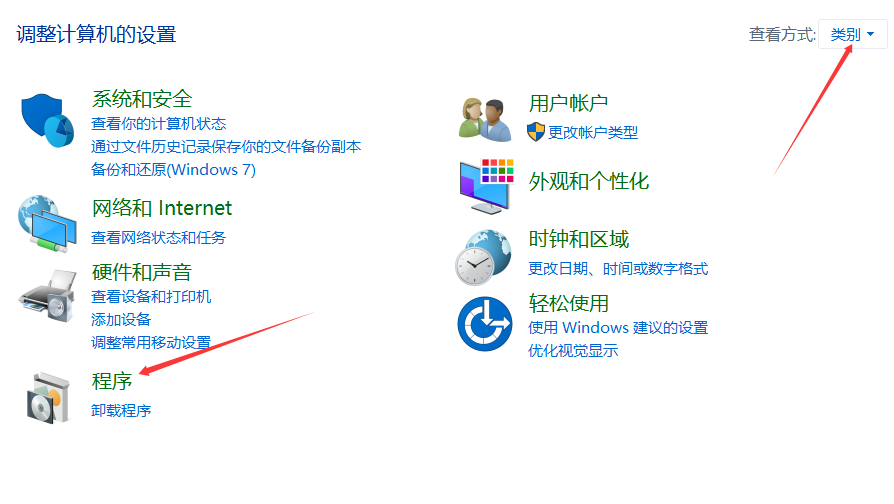  
但是这样的卸载方法通常会残留一些注册表缓存文件之类的，这些文件一方面没有且占空间，因为大部分又都在c盘可能还会容易导致c盘红的快，因此更推荐用强力一些的工具卸载使删除更干净，比较常见且简单多人用的就是**geek**这款软件只需到官网下载下来，解压直接运行就可以打开使用，另一款是我自己平时用的**Revo Uninstaller Pro**这个就相对麻烦但是更强力一些，但是麻烦我已经忘记怎么装上的了感兴趣的喜欢折腾的可以自行上小破站找教程安装。然后就是播放器，win系统自带的播放器解析力是比较有限的功能也很少支持的格式更是有限，如果要解码一些压制的资源单独花钱买插件具体体验怎么样很难说，所以这里推荐俩我自己比较常用首先是**PotPlayer**，这个播放器属于是比较有名的了，功能丰富支持格式也足够，可以就单纯当个拿来播放视频，也又一定折腾空间，具体小破站有很多教程可以自行了解。
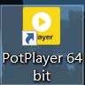  
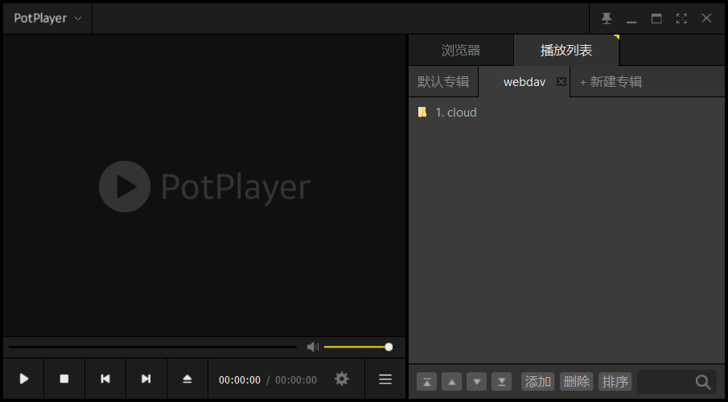
另一个就是**mpv.net**（这不是个网址，这个的原版播放器其实是mpv一个很好用的开源播放器，本质上没什么区别魔改了一点东西，然后这个就比较纯粹了没什么花里胡晒的功能就是个播放器，播放上没什么太大区别，然后软件开源。  
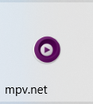  
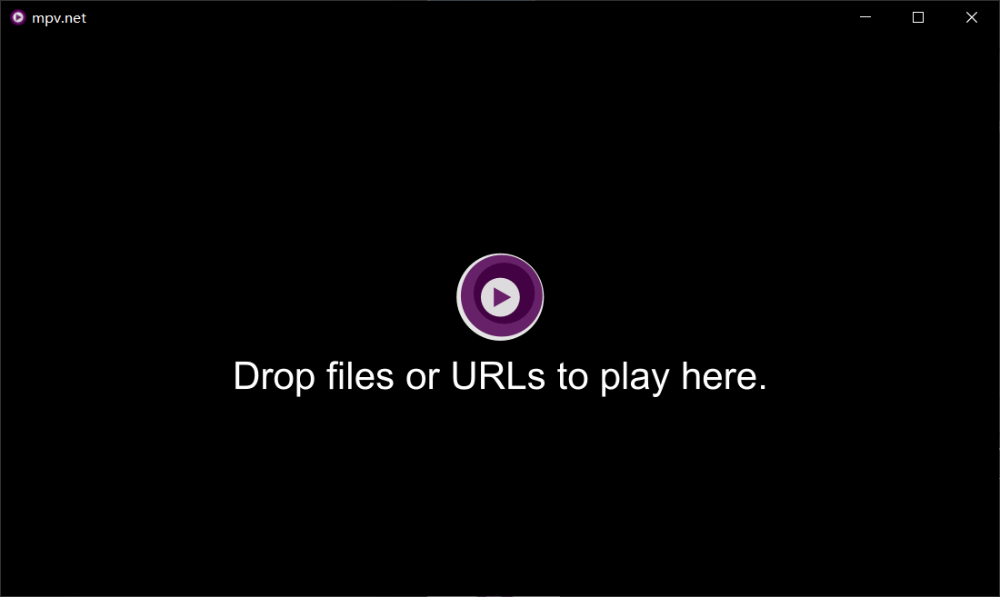  
