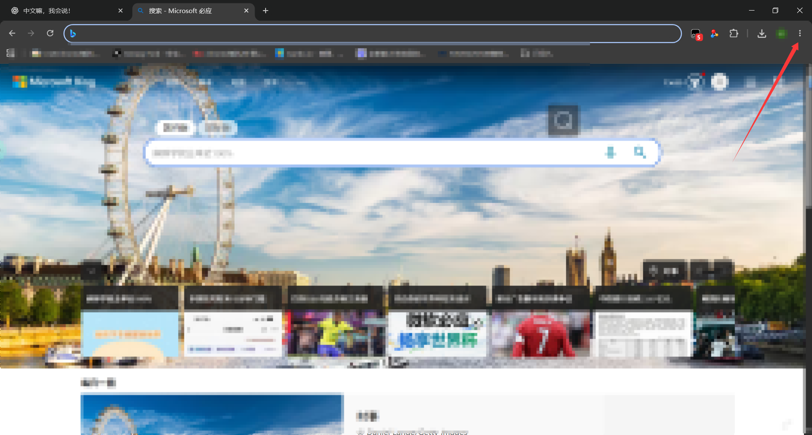
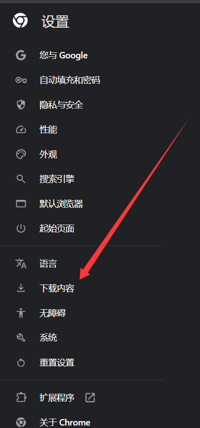
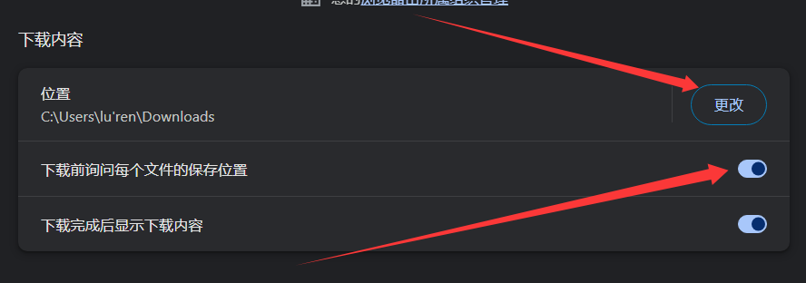
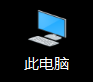
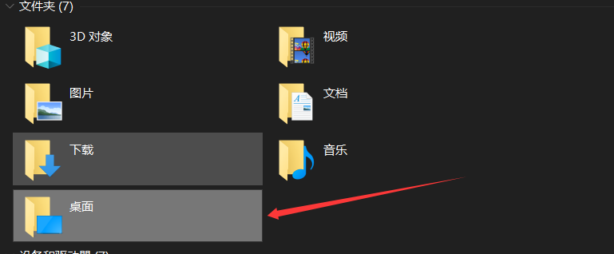
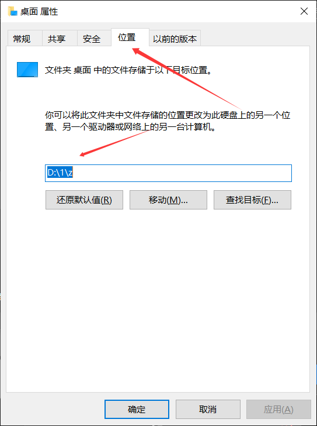

# 实用技巧
碰到比较多的一个是很多人反馈说自己电脑C盘用没多久就报红了，排除掉本身用得很多每个盘都满了的情况下原因很多的，但归根结底使用习惯不好，所以建议一开始就养成好的习惯省的时候花钱找别人清，这里展示一个工科生用了那么多年的c盘状态，还是比较健康的。  
  
首先，第一个坏习惯就是软件安装到C盘，这种状况又分两种，第一种就是有的人喜欢用微软自带的商店安装软件或者其他的xx软件管家之类的软件去安装应用，通过这些软件通常默认都会安装到C盘去，另一种就是虽然是从浏览器找官网下载的安装包，但有的人安装只管无脑下一步。所以，在安装软件的时候一定要注意尽量从官网去获取安装包，同时大部分软件安装过程中都会有设置安装路径这一步，默认都是C盘，可以自定义一下改到其他盘创建一个安装软件的文件夹进行安装，**切记路径用英文，英文不好可以用拼音**，避免一些不必要的麻烦，比如有的人同一个安装包同样的方法安装不上或者报错有很多就是这个原因，还有一个更常见的例子Steam安装路径中文直接就报错。**（后续可能也会写一些软件工具的具体安装步骤，会有更详细的安装过程，软件的安装基本大同小异所以可以用作参考，敬请期待，如果我没偷懒的话...）**  
另一个原因就是软件的缓存数据文件问题，软件大多数时候缓存数据文件都默认到C盘，可以手动去更改一下到别的盘，一般也有两种设置方式一种是类似PR，安装好后通过设置里面去手动修改，另一种就是类似QQ，在安装过程除了设置软件的安装位置还可以自定义另一个路径就是放数据文件，这两种可以自己在使用是多留意去修改，还有就是卸载不干净也会把一些残留的缓存数据文件，所以尽量不要直接用控制面板去卸载软件，尽量用上一篇文章提到的工具去卸载软件。
另外还有一个点就是各个软件的下载功能，很多人无脑直接点下载，大概率也是默认到C盘去，比如常用qq进行传文件，上面提到的使用浏览器进行下载之类的。解决方法也非常简单，第一种是直接改软件内的设置去更改下载的文件夹路径，以chrom浏览器为例，首先点开右上角的复选框，从里面找到设置进入设置界面，在设置里点击下载内容，然后点击更改就可以更改下载文件的保存路径，当然还有另一种方式也是我个人一直用的方式就是习惯性用另存为，比如，chrom浏览器的下载设置里下载前询问每个文件的保存位置的设置开启，这样每次下载的时候都会弹窗出来，然后点击弹窗上的另存为然后再手动选择保存的路径，因为我的文件都有分类下载不同类型用途的文件都会放到对应文件夹以方便查找，QQ则是直接点对应文件下方的另存为也可以进行一样的操作，如果下方没有显示另存为功能右键鼠标也是可以调出来另存为的选项的。  
  
  
  
此外花园一种坏习惯就是从不整理喜欢一股脑把什么都丢桌面，桌面他的默认路径其实也是C盘，虽然这个是可以更改为其他路径的，我是推荐更改的，但是即使更改了我依然不推荐把东西丢桌面，电脑用的时间一般很长，上面大大小小会有非常多的文件，请提前养成创建好文件夹整理分类的好习惯，不然会越来越乱且很难看，当然这只是推荐，非要犟种跟我也没关系。讲一下怎么去更改桌面的路径 **（最好再电脑到手什么都没有的时候就更改，避免装了软件要进行额外的调整）**，首先，点击此电脑，右键桌面点击属性，再点击位置，即可进行更改，更改完点击应用确定。  
  
  
  
